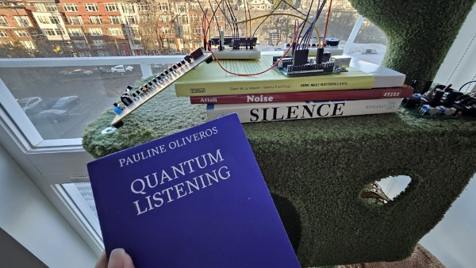

> **“There is no such thing as silence. Something is always happening that makes a sound.”**
> — John Cage

I like to think of silence as noise. And when you amplify silence, you get pure random noise.

It's easy to produce random noise with hardware, but it's impossible with software. You can only do as good as psuedorandom. It inspired me to do this project: implementing various psuedorandom number generators to produce noise. I named it `four33`, after John Cage's composition 4'33". The random noise is white noise, and therefore, "silence."